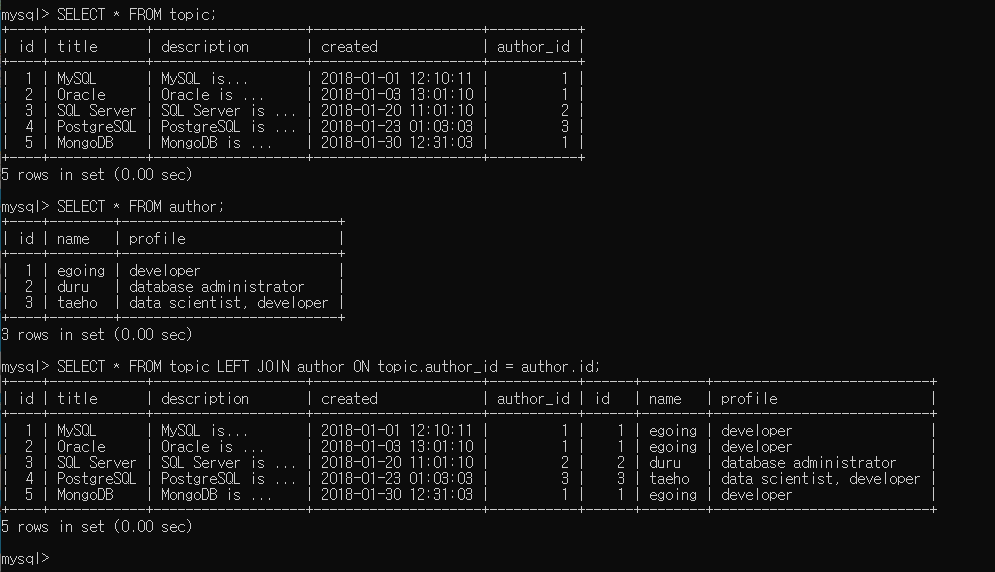

# MySQL

> 3대 관계형 데이터베이스 중 하나

## SQL

> Structed Query Langauage

### 구조

- `데이터베이스`
  - 표들을 grouping할 때 사용하는 일종의 폴더
- `schema`
  - 표들을 grouping할 때 데이터베이스 대신 사용하는 표현 

- `DATABASE SERVER`
  - 스키마들을 grouping하고 있는 `server`
  - `database client` <->`database server`
  - 전 세계 수많은 사람들이 `MySQL workbench`와 같은 프로그램을 통해 하나의 `database server`를 활용해서 데이터를 주고받게 된다.

### 서버접속

- 디렉토리에서 `mysql -uroot -p` 입력

### 데이터베이스 생성과 사용준비

- `CREATE DATABASE {데이터베이스명};`
- `DROP DATABASE {데이터베이스명};`
- `SHOW DATABASES;`
- `USE {데이터베이스명};`
- `SHOW TABLES;` : 테이블을 보여준다.
- `DESC {테이블명};` : 테이블의 구조를 보여준다.

### MySQL 테이블 생성

```mysql
CREATE TABLE topic(
    id INT(11) NOT NULL AUTO_INCREMENT,
    title VARCHAR(100) NOT NULL,
    description TEXT NULL,
    created DATETIME NOT NULL,
    author VARCHAR(30) NULL,
    profile VARCHAR(100) NULL,
    PRIMARY KEY(ID)); 중복되면 안된다는 의미
```


### CRUD

> **Create**  **Read** Update Delete

- INSERT
- SELECT
- UPDATE
- DELETE

#### INSERT

```mysql
INSERT INTO {tablename} (c1, c2, c3, ...) VALUES ('content1','content2', 'content3', ...);
```

#### SELECT

```MYSQL
SELECT * FROM {tablename}; # 테이블의 모든 행과 열을 출력할 수 있습니다.
SELECT {col_name1, col_name2, ...} from {table_name} WHERE {col_name}='{col}'; # 열 제목에서 해당 이름을 가진 행만 출력합니다.
GROUP BY HAVING ORDER BY(ASC:오름차순 DESC:내림차순) LIMIT OFFSET 등등...
```

#### UPDATE

```mysql
UPDATE {table_name} SET {col_name}='바꿀내용' WHERE {col_name}='원래내용' ORDER BY LIMIT
```

#### DELETE

```mysql
DELETE FROM {table_name} WHERE id={number}; # 해당 행 삭제
```


### 관계형 데이터베이스

#### 테이블 분리하기

#### JOIN

```mysql
SELECT * FROM {테이블명} LEFT JOIN {JOIN할 테이블명} ON {테이블명}.{JOIN할 col} = {JOIN할 테이블명}.id;
```



